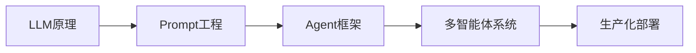

---
created: 2026-07-17
type: moc
aliases: [AI, 人工智能, 智能体, Agent]
---

# 🤖 AI 与智能体 · Map of Content

> **Karpathy 视角**: 不理解 Transformer？从零写一个 microGPT → 理解 Token 如何预测 → 扩展为真正可用的 Agent

## 🎯 学习路线



## 📍 当前重点：Agent 智能体搭建

- [[LLM推理原理|LLM 推理原理]]
- [[AI与智能体/Agent架构模式|Agent 架构模式（ReAct / Plan-and-Execute）]]
- [[Tool Use与Function Calling|Tool Use 与 Function Calling]]
- [[多Agent协作模式|多 Agent 协作模式]]
- [[机器人/Koishi机器人框架|Koishi 机器人框架与插件架构]]

## 📂 概念笔记
```dataview
TABLE created as "创建", updated as "更新"
FROM "02-笔记/概念笔记" and #ai
SORT updated DESC
```

## 🛠️ 项目实战
```dataview
TABLE status as "状态"
FROM "04-项目" and #ai
SORT status DESC
```

## 📡 Horizon 日报中的 AI 资讯
```dataview
TABLE date as "日期"
FROM "06-日报存档"
WHERE contains(file.name, "zh")
SORT file.name DESC
LIMIT 5
```

## 🔗 关联领域
- [[MOC-网安|🔐 AI 安全（AI Agent 的安全性）]]
- [[MOC-计算机通识|💻 Python / 系统工程]]
