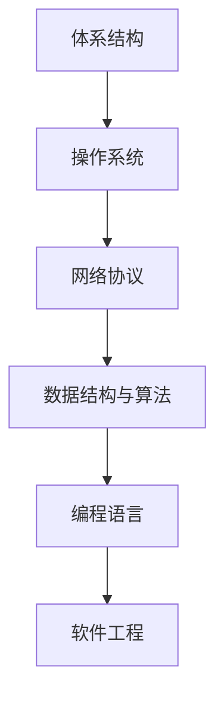

# 💻 计算机通识 · Map of Content

> **Karpathy 视角**: 计算机科学是"手艺活"——从系统底层到上层应用，每一层都值得亲手玩一遍

## 🎯 知识地图



## 📂 概念笔记
```dataview
TABLE created as "创建", updated as "更新"
FROM "02-笔记/概念笔记" and #cs
SORT updated DESC
```

## 🔗 关联领域
- [[MOC-网安|🔐 网络安全（网络协议 → 安全）]]
- [[MOC-AI与智能体|🤖 AI（编程基础 → AI 开发）]]
