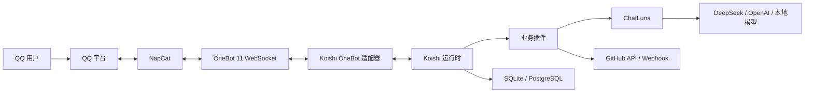
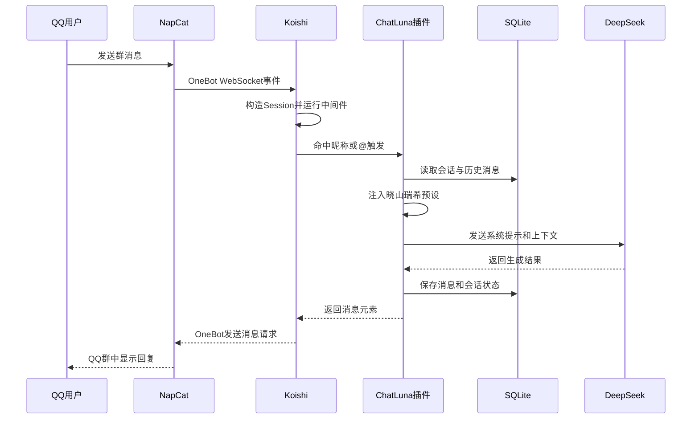
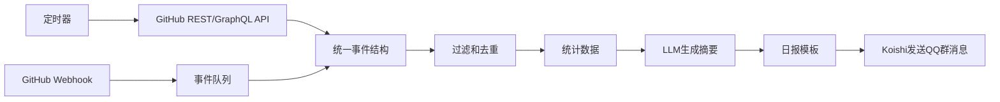

# Koishi 机器人框架

> **一句话**：Koishi 是一个以 TypeScript、插件系统和 Web 控制台为核心的跨平台聊天机器人运行时，它把消息平台、业务插件、数据库和外部服务组织在同一套可扩展架构中。

## 先建立正确定位

Koishi 不是 QQ 客户端，不负责登录个人 QQ；它也不是大语言模型，不会自己生成 AI 回复。

在一个 QQ AI 机器人系统中，各组件通常这样分工：

| 组件 | 职责 | 可以类比为 |
|---|---|---|
| QQ | 用户实际聊天的平台 | 前台入口 |
| NapCat | 登录 QQ，将 QQ 事件转换成 OneBot 事件 | QQ 驱动程序 |
| OneBot | 机器人平台之间约定的通信协议 | USB 协议 |
| Koishi OneBot 适配器 | 把 OneBot 事件转换成 Koishi 的统一事件 | 协议转换器 |
| Koishi | 加载插件、路由消息、管理命令和数据 | 机器人操作系统 |
| ChatLuna | 管理 AI 会话、模型、上下文和人设 | AI 对话引擎 |
| DeepSeek | 实际进行语言推理和生成 | 大脑 |
| SQLite | 保存用户、群组、会话和历史消息 | 本地记忆 |

最容易犯的错误是把这些东西统称为“机器人”。实际上，它们位于完全不同的层。



## Koishi 能做什么

Koishi 的能力主要来自插件。它可以构建：

- QQ、Telegram、Discord、KOOK 等跨平台机器人
- 群管理、签到、抽奖、词条、欢迎和审核机器人
- AI 对话、人设扮演、长期记忆和知识库机器人
- GitHub commit、issue、PR、Actions 状态通知
- 每日项目日报、群聊总结和定时提醒
- 图片渲染、语音合成、文件处理和网页抓取
- 游戏数据查询、接口聚合和自动化工作流
- 带 Web 管理后台、插件市场和多机器人实例的平台

Koishi 本身提供的是“承载能力”，具体业务需要安装现有插件或自行开发插件。

## 为什么选择 Koishi

### 优点

1. **插件化彻底**：命令、数据库、适配器、AI、控制台页面都可以作为插件加载。
2. **Web 控制台成熟**：可以查看日志、安装插件、修改配置、访问数据库和使用沙箱。
3. **TypeScript 生态**：可复用 Node.js、npm、前端和 Web API 生态。
4. **跨平台抽象**：插件通常面向统一的 `Session` 编写，不必为每个平台重写全部逻辑。
5. **可热重载**：开发模式下，插件修改后可以自动重新加载。
6. **数据库抽象**：业务插件不必直接拼 SQL，可通过统一 API 操作不同数据库。
7. **依赖注入和作用域**：插件可以声明依赖，并限制自己只在特定平台、群或用户中工作。

### 局限

1. Koishi 不负责绕过 QQ 官方限制，个人 QQ 接入仍依赖 NapCat 等非官方实现。
2. 插件质量参差不齐，安装第三方插件前应检查源码、维护状态和权限。
3. 大型项目中，配置、插件版本和依赖关系仍需要工程化管理。
4. AI、搜索、GitHub 等服务通常需要额外 API Key，也可能产生费用。
5. 社区插件可能出现 alpha 版本兼容问题，升级前必须验证。

## 核心概念

### 1. Adapter：平台适配器

适配器负责把不同平台事件映射成统一接口。例如 QQ 的 OneBot 消息、Discord 消息和 Telegram 消息，进入 Koishi 后都会形成相似的会话对象。

业务插件可以主要关注：

```ts
session.userId
session.channelId
session.guildId
session.content
session.platform
```

而不必直接处理每个平台完全不同的原始 JSON。

需要注意，平台能力并不完全相同。某个平台支持戳一戳、合并转发或群禁言，另一个平台可能没有。调用平台特有能力前必须做能力判断。

### 2. Session：一次事件的上下文

`Session` 表示一次消息或平台事件。它不仅包含文本，还包含：

- 谁发送了消息
- 在哪个平台发送
- 来自私聊、频道还是群组
- 消息元素，如文本、图片、引用、语音
- 当前机器人实例
- 回复、发送和平台调用方法

典型用法：

```ts
ctx.on('message', async (session) => {
  console.log(session.platform)
  console.log(session.userId)
  console.log(session.content)

  await session.send('收到消息')
})
```

### 3. Context：插件的运行上下文

`Context` 通常写作 `ctx`。它不是普通的全局变量，而是 Koishi 的服务容器、事件总线和作用域对象。

插件通过 `ctx` 完成：

- 注册命令
- 监听事件
- 注册中间件
- 访问数据库
- 调用其他插件提供的服务
- 创建定时任务
- 限定生效范围
- 在卸载时自动清理资源

```ts
export function apply(ctx: Context) {
  ctx.command('hello').action(() => 'Hello Koishi')
}
```

Koishi 强调作用域。例如，可以让一个插件只在 OneBot 平台、某个群或满足某个条件的事件中运行，而不影响其他机器人实例。

### 4. Plugin：插件

一个最小插件通常导出名称、配置 Schema 和 `apply()`：

```ts
import { Context, Schema } from 'koishi'

export const name = 'hello'

export interface Config {
  greeting: string
}

export const Config: Schema<Config> = Schema.object({
  greeting: Schema.string().default('你好'),
})

export function apply(ctx: Context, config: Config) {
  ctx.command('hello [name:text]', '发送问候')
    .action((_, name) => `${config.greeting}，${name || '朋友'}！`)
}
```

这里有三个关键点：

- `Config` 决定 Web 控制台里显示哪些配置控件。
- `apply()` 是插件加载时执行的入口。
- 插件被停用或热重载时，Koishi 会清理在作用域内注册的事件和任务。

### 5. Command：命令系统

命令适合明确、可预测的用户操作：

```text
repo.daily owner/repository
weather 上海
remind 30m 提交代码
```

命令可以包含：

- 必选参数：`<repo:string>`
- 可选参数：`[title:text]`
- 选项：`-p <page:number>`
- 权限等级
- 别名和子命令
- 输入校验和帮助信息

```ts
ctx.command('repo.daily <repo:string>')
  .option('days', '-d <days:number>', { fallback: 1 })
  .action(async ({ options }, repo) => {
    return `生成 ${repo} 最近 ${options.days} 天的日报`
  })
```

### 6. Middleware：消息中间件

中间件适合处理所有消息，例如：

- 敏感词过滤
- 日志记录
- 群白名单
- AI 自然语言触发
- 频率限制
- 未匹配命令的兜底回复

```ts
ctx.middleware(async (session, next) => {
  if (session.content === 'ping') return 'pong'
  return next()
})
```

中间件按顺序执行。忘记调用 `next()` 会阻止后续中间件，错误地多次调用则可能导致重复回复。

### 7. Service 与依赖注入

插件可以给其他插件提供服务，也可以声明自己依赖某项服务。例如 AI 适配器依赖 ChatLuna，数据插件依赖数据库。

```ts
export const inject = ['database']
```

依赖注入的价值是：

- 在依赖尚未准备好时不错误启动
- 插件卸载时自动解除关系
- 降低插件之间的硬编码耦合
- 让同类服务可以替换实现

在当前实践项目中：

```text
ChatLuna Core
    ↑ required
DeepSeek Adapter
```

如果 ChatLuna 没加载，DeepSeek 适配器即使有 API Key 也无法工作。

### 8. Database：数据库层

Koishi 可以通过插件接入 SQLite、MySQL、PostgreSQL 等数据库。SQLite 适合本地测试和单机部署，PostgreSQL 更适合多实例和平台化。

插件可以声明数据模型：

```ts
import { Context } from 'koishi'

declare module 'koishi' {
  interface Tables {
    repo_subscription: RepoSubscription
  }
}

interface RepoSubscription {
  id: number
  guildId: string
  repository: string
}

ctx.model.extend('repo_subscription', {
  id: 'unsigned',
  guildId: 'string',
  repository: 'string',
}, {
  autoInc: true,
  primary: 'id',
})
```

然后使用统一 API：

```ts
await ctx.database.create('repo_subscription', {
  guildId: session.guildId!,
  repository: 'owner/repo',
})

const rows = await ctx.database.get('repo_subscription', {
  guildId: session.guildId,
})
```

### 9. Console：Web 控制台

Koishi 控制台不是单纯的日志页面，而是可扩展的管理前端。常见页面包括：

- 插件配置
- 插件市场
- 依赖管理
- 命令列表
- 数据库浏览
- 日志
- 文件浏览
- Sandbox 沙箱
- 状态和性能信息

插件还可以注册自己的控制台页面，因此可以把“人设编辑器”“GitHub 仓库选择器”“日报配置器”做成原生 Koishi 页面。

## 一条消息如何被处理

以“瑞希，帮我总结今天的项目提交”为例：



## 配置文件和项目结构

一个典型模板项目：

```text
project/
├─ koishi.yml            # 插件树与运行配置
├─ package.json          # npm 依赖和脚本
├─ .env                  # 可公开的环境配置
├─ .env.local            # 本地密钥，不提交 Git
├─ node_modules/         # 安装后的依赖
├─ data/                 # SQLite、缓存和插件数据
├─ plugins/              # 自己开发的插件
├─ external/             # 克隆到工作区的外部插件源码
└─ .yarn/                # 项目内置 Yarn
```

`koishi.yml` 本质上是插件树：

```yaml
plugins:
  group:storage:
    database-sqlite:
      path: data/koishi.db

  group:adapter:
    adapter-onebot:
      protocol: ws
      endpoint: ws://127.0.0.1:3001

  group:business:
    github-daily:
      schedule: "0 9 * * *"
```

以 `~` 开头的插件表示已配置但未启用：

```yaml
~adapter-onebot:
  protocol: ws
```

Koishi 保存配置时可能在插件名后增加实例 ID：

```yaml
adapter-onebot:cw1hch:
```

这个 ID 用来区分同一种插件的多个实例。

## 如何使用 Koishi

### 1. 启动项目

本地实践项目位于：

```text
E:\code\MizukiBot
```

由于 Windows 中文路径下 `cross-env` 的命令代理出现过编码问题，当前使用脚本启动：

```powershell
cd "E:\code\MizukiBot"
.\scripts\start-koishi.ps1
```

控制台地址：

```text
http://127.0.0.1:5140
```

停止后台服务：

```powershell
.\scripts\stop-koishi.ps1
```

### 2. 先使用 Sandbox

Sandbox 可以在没有连接 QQ 时模拟用户、私聊和群聊。推荐所有插件先在沙箱验证：

1. 打开左侧 Sandbox。
2. 点击“添加用户”。
3. 输入 `help` 查看命令。
4. 测试插件功能和权限。
5. 查看 Logs 是否有报错。

这能把“业务插件错误”和“QQ 接入错误”分开排查。

### 3. 从插件市场安装插件

1. 打开 Market。
2. 搜索插件名。
3. 检查维护时间、下载量、依赖和源码仓库。
4. 安装后进入插件配置页。
5. 配置并启用实例。
6. 在 Sandbox 测试。

安装插件实际上会修改 `package.json` 并安装 npm 包；启用插件则会修改 `koishi.yml`。

### 4. 接入 QQ

QQ 个人号常见接入链路是 NapCat + OneBot 11：

1. NapCat 登录 QQ。
2. 在 NapCat 开启 OneBot 11 WebSocket 服务。
3. 建议仅监听 `127.0.0.1`，设置访问令牌。
4. 在 Koishi 启用 `adapter-onebot`。
5. 地址设置为 `ws://127.0.0.1:3001`。
6. 在日志确认机器人上线。
7. 在测试群用 `help` 或简单命令验证。

OneBot 是通信协议，不是 QQ 官方接口。个人账号自动化存在限制和封号风险，应控制消息频率，避免营销、刷屏和批量拉群。

## 当前实践项目完成了什么

截至 2026-08-03，本地项目已经具备：

- Koishi 4.18 Web 控制台
- SQLite 数据持久化
- ChatLuna AI 会话核心
- DeepSeek 专用适配器
- DeepSeek v4 模型列表和真实推理调用
- 晓山瑞希普通对话预设
- 高级群友预设文件
- 会话创建、切换、归档和历史记录
- Sandbox 实际对话测试
- API Key 与代码分离
- Windows 启动、停止脚本
- OneBot 配置预留

当前默认模型：

```text
deepseek/deepseek-v4-flash
```

低延迟模型：

```text
deepseek/deepseek-v4-flash-instant
```

完整链路测试中，`flash-instant` 曾达到约 828 ms；模型服务延迟会随网络和负载变化。

尚未正式完成：

- NapCat 和真实 QQ 群连接
- GitHub 仓库绑定
- GitHub Webhook
- 每日项目日报
- Web 人设编辑器
- 高级主动群聊模式
- 向量知识库和长期记忆
- 多租户和多机器人实例管理

## AI 人设如何接入 Koishi

Koishi 不直接理解“人设”。当前架构使用 ChatLuna 预设文件：

```text
data/chathub/presets/mizuki.yml
```

预设由以下部分组成：

1. `keywords`：预设名和别名。
2. `system` 提示：身份、性格、表达和边界。
3. few-shot 示例：用多轮示例约束实际说话风格。
4. 用户提示格式：注入昵称和用户 ID。

消息最终组合为：

```text
系统人设
+ 当前用户信息
+ 历史会话
+ 当前消息
+ 工具结果
→ 模型
```

人设不是简单的“温度参数”。稳定人设通常需要：

- 清晰的身份事实
- 行为原则
- 语言风格
- 情绪反应规则
- 禁止事项
- 多组正向示例
- 长期记忆与当前状态分离

## GitHub 每日日报应如何实现

可以开发 `github-daily` 插件：



建议把“事实计算”和“语言生成”分开：

- 代码负责计算 commit 数、PR 数、CI 状态和贡献者。
- LLM 只负责把结构化事实整理成自然语言。
- 日报中保留原始链接，防止 AI 摘要不可核验。

配置示例：

```yaml
repository: owner/repo
schedule: "0 9 * * *"
timezone: Asia/Shanghai
include:
  - commits
  - pull_requests
  - issues
  - actions
model: deepseek/deepseek-v4-pro
```

Webhook 原理可参考 [[Webhook实现原理]]，定时任务和 CI 可参考 [[GitHub Actions 入门]]。

## 可视化平台如何构建

如果目标是“Web 端定制人设、安装插件、绑定 GitHub、配置日报”，可以把 Koishi 当作后端运行时，在控制台扩展四个页面：

1. **机器人实例**：平台账号、群白名单、默认模型。
2. **人设工坊**：身份字段、说话风格、示例对话、预览测试。
3. **GitHub 连接器**：OAuth/GitHub App、仓库选择、权限。
4. **工作流编辑器**：触发器、数据源、过滤器、AI 总结、发送目标。

为了可复现，应支持导出：

```text
bot.yaml
personas/
workflows/
plugins.lock
.env.example
```

部署到另一台机器时，只需要恢复配置、安装锁定版本并注入密钥。

## 调试方法

### 插件没有加载

查看 Logs 是否出现：

```text
loader apply plugin <plugin-name>
```

如果没有：

- 检查插件是否安装在 `package.json`。
- 检查 `koishi.yml` 名称前是否有 `~`。
- 检查依赖服务是否已启用。
- 完整重启，排除热重载没有初始化的问题。

### 模型列表为空

排查顺序：

1. ChatLuna 核心是否启用。
2. 模型适配器是否启用。
3. API Key 是否为空。
4. `/models` 接口是否返回 200。
5. 适配器是否支持当前模型名称。
6. 是否需要专用服务商适配器。
7. 重启后再运行 `chatluna.model.list`。

当前项目曾遇到通用 OpenAI 适配器不能正确注册 DeepSeek v4 模型，最后改为 DeepSeek 专用适配器解决。这说明“接口兼容”不等于“插件内部模型能力完全兼容”。

### QQ 无法连接

检查：

- NapCat 是否在线。
- OneBot WebSocket 是否开启。
- 端口是否一致。
- Koishi 使用客户端 `ws` 还是反向 `ws-reverse`。
- token 是否一致。
- 防火墙和代理是否拦截本地连接。

### 出现重复回复

常见原因：

- 同一个命令被多个插件注册。
- 中间件既返回消息又调用了 `next()`。
- 多个机器人实例同时监听同一事件。
- 普通 ChatLuna 和主动群友插件同时触发。

## 安全与工程实践

- API Key 放在 `.env.local`，仓库只提交 `.env.example`。
- OneBot 服务仅监听本机，远程连接使用 token 和反向代理鉴权。
- GitHub 优先使用 GitHub App 或细粒度 Token，只授予需要的仓库和权限。
- 插件执行写操作前做管理员权限检查和二次确认。
- 给 AI 调用设置每日额度、并发限制和超时。
- 日志中脱敏 token、cookie、Authorization header 和用户隐私。
- 锁定依赖版本，升级 ChatLuna alpha 插件前先在 Sandbox 验证。
- 定期备份 `data/koishi.db` 和人设配置。
- 对外提供控制台时必须启用认证，不要把无鉴权的 5140 端口暴露到公网。

## 与其他方案对比

| 方案 | 语言 | 优势 | 适合场景 |
|---|---|---|---|
| Koishi | TypeScript | Web 控制台、插件市场、跨平台 | 可视化平台、插件化产品 |
| NoneBot2 | Python | Python/AI 生态强、开发直观 | Python 团队、数据和 AI 插件 |
| 直接使用 OneBot SDK | 多种 | 控制最直接、依赖少 | 极简机器人、协议研究 |
| 从零写 QQ 协议 | 多种 | 完全控制 | 不建议普通业务项目采用 |

如果目标是“让非开发者在 Web 端配置机器人”，Koishi 的控制台和插件 Schema 很有优势。如果目标是大量 Python 数据分析，NoneBot2 可能更顺手。

## 推荐学习路线

### 阶段 1：会使用

- 启动控制台
- 使用 Sandbox
- 安装和配置插件
- 阅读日志
- 理解 `koishi.yml`

### 阶段 2：写第一个插件

- 注册 `hello` 命令
- 读取参数和选项
- 使用 `Session`
- 添加配置 Schema
- 测试热重载

### 阶段 3：状态和数据库

- 定义一张表
- 保存群配置
- 实现增删改查
- 为命令加入权限检查

### 阶段 4：连接外部服务

- 调用 GitHub API
- 接收 [[Webhook实现原理|Webhook]]
- 实现超时、重试和限流
- 将密钥放进环境变量

### 阶段 5：AI 和工作流

- 接入模型适配器
- 设计人设和 few-shot 示例
- 增加工具调用
- 结合 [[Agent架构模式]] 设计任务循环
- 实现日报、知识库和长期记忆

## Karpathy 式动手练习

按顺序完成这些小项目：

1. `ping → pong`，理解插件入口。
2. `echo <text>`，理解命令参数。
3. 群欢迎语，理解事件和 Session。
4. 每人每日签到，理解数据库。
5. GitHub star 查询，理解 HTTP API。
6. 定时项目日报，理解调度与消息发送。
7. AI 人设聊天，理解模型和上下文。
8. Web 人设编辑器，理解 Console 扩展。

不要一开始就写完整平台。每一步都在 Sandbox 中形成可验证闭环，再进入下一层。

## 关键认识

1. Koishi 的核心价值不是“自带多少功能”，而是让功能可以组合、隔离、配置和卸载。
2. Adapter 解决平台差异，Plugin 解决业务扩展，Service 解决插件协作，Database 解决状态持久化。
3. Web 控制台来自配置 Schema 和 Console 插件，因此插件设计会直接决定最终产品体验。
4. AI 是 Koishi 中的一类外部服务，不应侵入所有业务逻辑。
5. 一个可复现平台需要配置文件、锁定依赖、环境变量、数据迁移和备份，而不仅是 Docker 镜像。

## 官方资料

- [Koishi 官方站点](https://koishi.chat/)
- [Koishi 介绍](https://koishi.chat/zh-CN/manual/introduction.html)
- [创建模板项目](https://koishi.chat/zh-CN/manual/starter/boilerplate.html)
- [插件开发指南](https://koishi.chat/zh-CN/guide/plugin/)
- [数据库基本用法](https://koishi.chat/zh-CN/guide/database/)
- [Koishi GitHub](https://github.com/koishijs/koishi)
- [OneBot 11 标准](https://github.com/botuniverse/onebot-11)

## 关联概念

- [[YAML文件是什么]]：`koishi.yml` 的配置语法
- [[Webhook实现原理]]：GitHub 事件主动推送到机器人
- [[GitHub Actions 入门]]：定时日报和自动部署
- [[Agent架构模式]]：AI 工具调用与任务循环
- [[MOC-AI与智能体]]：返回 AI 与 Agent 导航
